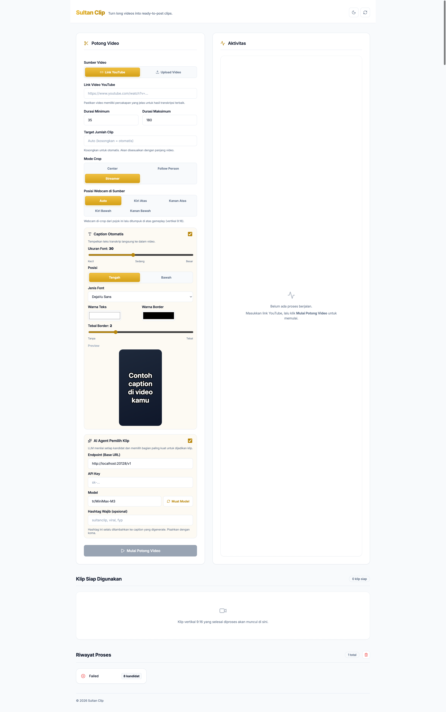

# Sultan Clip

> **Turn long videos into vertical clips — locally.** Transcribe, crop, subtitle, and export 9:16 ready-to-post videos in one pipeline.

---

## Preview



---

## What It Does

Sultan Clip downloads a YouTube video, transcribes it locally with `faster-whisper`, scores the transcript to find the best clip candidates, then exports each as a 1080×1920 MP4 with burned-in subtitles, SRT sidecars, and JSON metadata — all through a clean web dashboard or from the terminal.

- 🎙 **Local transcription** — no cloud API, no usage limits  
- 🧠 **Smart scoring** — algorithmically picks the best moments  
- ✂️ **Face-aware crop** — person detection keeps the subject framed  
- 🎨 **Custom captions** — font, size, colour, outline, position  
- 🤖 **AI captions** — optional OpenAI-compatible integration  
- ✂️ **Timeline trim** — adjust clip in/out points visually, snap to
  transcript sentences, re-export without re-transcribing  
- 🐳 **Dockerised** — one command to run the full stack  

---

## Quick Start

**Prerequisites:** Docker + Docker Compose

```bash
cp .env.docker.example .env
docker compose --env-file .env up -d --build
```

| Service | URL |
|---------|-----|
| Frontend | http://localhost:3000 |
| Backend API | http://localhost:8010 |
| Health check | http://localhost:8010/api/health |

> First run downloads faster-whisper model (~500 MB). Subsequent runs use cache.

---

## Architecture

```
┌─────────────┐          ┌──────────────────────────────────┐
│  Frontend   │  HTTP    │             Backend               │
│  Next.js    │◄────────▶│        FastAPI (Python 3.12)       │
│  :3000      │          │        :8010                       │
└─────────────┘          └────────────┬─────────────────────┘
                                      │
                       ┌──────────────┴──────────────┐
                       │         clipper.py           │
                       │  download → transcribe →     │
                       │  score → export (mp4/srt)    │
                       └──────────────────────────────┘
```

**Pipeline stages:**

1. **Download** — `yt-dlp` fetches the video at best available quality (up to 1080p)  
2. **Audio** — FFmpeg extracts mono 16kHz WAV  
3. **Transcribe** — `faster-whisper` runs locally (GPU optional)  
4. **Score** — Transcript analysed for high-value segments  
5. **Export** — 1080×1920 MP4, SRT subtitle file, JSON metadata per clip  

---

## Manual Dev Setup

### Backend
```bash
cd backend
python3 -m venv .venv
source .venv/bin/activate
pip install -r requirements.txt
uvicorn api:app --host 127.0.0.1 --port 8010 --reload
```

### Frontend
```bash
cd frontend
npm install
npm run dev
```

UI at http://127.0.0.1:3000 connects to backend at port 8010.

---

## CLI

The full pipeline runs without the UI:

```bash
cd backend
source .venv/bin/activate

# Generate 5 clips, 35–180 seconds each
python clipper.py "https://youtu.be/VIDEO_ID" --top 5 --min 35 --max 180

# Quick test (first 3 minutes, smallest model)
python clipper.py "https://youtu.be/VIDEO_ID" \
  --model Systran/faster-whisper-base \
  --analyze-seconds 180 --top 1
```

### Options

| Flag | Default | |
|---|---|---|
| `--top` | auto | Target clip count |
| `--min` | 35 | Minimum duration (s) |
| `--max` | 180 | Maximum duration (s) |
| `--model` | `faster-whisper-small` | Whisper model |
| `--language` | `id` | Transcription language |
| `--crop-mode` | `center` | `center` / `person` / `streamer` |
| `--caption-font-size` | 30 | Subtitle size |
| `--caption-position` | `center` | `center` / `bottom` |
| `--caption-color` | `#FFFFFF` | Hex colour |
| `--caption-font` | `DejaVu Sans` | Font face |
| `--required-hashtags` | — | Comma-separated tags |
| `--ai-enabled` | — | Enable AI caption mode |
| `--ai-base-url` | — | OpenAI-compatible endpoint |
| `--ai-model` | — | Model ID |
| `--ai-api-key` | — | Provider key |

---

## API

| Method | Path | |
|---|---|---|
| `GET` | `/api/health` | `{"status":"ok"}` |
| `POST` | `/api/jobs` | Submit a job |
| `GET` | `/api/jobs` | List all jobs |
| `GET` | `/api/jobs/{id}` | Job status + results |
| `DELETE` | `/api/jobs` | Clear all jobs |
| `POST` | `/api/uploads` | Upload local video |
| `GET` | `/api/probe` | Get YouTube video duration |
| `POST` | `/api/models` | List LLM models |
| `GET` | `/outputs/{path}` | Serve clip files |
| `GET` | `/api/jobs/{id}/timeline` | Timeline data for trim editor (source URL, segments, candidates) |
| `POST` | `/api/jobs/{id}/recut` | Recut a clip with new `{index, start, end}` — returns updated clip + candidate |

### Job states

`queued` → `running` → `completed`  
　　　　　　↘ `failed`

---

## Configuration

`.env` (Docker mode):

| Variable | Default | |
|---|---|---|
| `BACKEND_PORT` | `8010` | |
| `FRONTEND_PORT` | `3000` | |
| `NEXT_PUBLIC_API_BASE` | `http://localhost:8010` | Browser-facing |

For remote servers, point `NEXT_PUBLIC_API_BASE` to the public backend URL.

---

## Tech Stack

| Layer | Technology |
|---|---|
| UI | Next.js 16, React 19, TypeScript |
| API | Python 3.12, FastAPI, Uvicorn |
| Video | yt-dlp, FFmpeg, OpenCV |
| Transcription | faster-whisper (local) |
| Face detection | YuNet ONNX (bundled, 230 KB) |
| LLM | OpenAI-compatible (optional) |
| Runtime | Docker, Docker Compose |

---

## Project Structure

```
├── backend/
│   ├── api.py              FastAPI routes
│   ├── clipper.py          Core pipeline
│   ├── llm.py              LLM client
│   ├── models/             ONNX face detection
│   ├── outputs/            Generated files
│   ├── tests/              Unit tests
│   └── Dockerfile
├── frontend/
│   ├── app/
│   │   ├── page.tsx        Main page
│   │   ├── layout.tsx      Root layout
│   │   ├── globals.css     Design tokens
│   │   └── _components/    UI components
│   ├── lib/                API client, utils
│   ├── types/              TypeScript types
│   └── Dockerfile
├── docker-compose.yml
├── LICENSE                 MIT
└── NOTICE                  Third-party notices
```

---

## Notes

- **First run** downloads Whisper model (~500 MB) and YuNet ONNX (~230 KB). Cached locally afterward.
- **GPU** is used automatically if CUDA is available in Docker.
- **Disk usage** — each job stores source video, audio, transcript, and clips under `backend/outputs/`. Clean up with `DELETE /api/jobs`. The source video is now retained after export (to support the timeline trim editor); cleaned up via the same `DELETE /api/jobs` endpoint. Upload-source jobs do not get the editor (the upload is deleted right after processing).
- Only process content you own or have rights to use. Follow YouTube Terms of Service.

---

## Desktop Installer

Sultan Clip can be packaged as a native desktop app via Tauri v2 + PyInstaller.

### How to build (local)

```bash
# 1. Frontend static export
cd frontend && npm ci && npm run build && cd ..

# 2. Backend bundle (PyInstaller onedir)
cd backend
python -m venv .venv
source .venv/bin/activate
pip install -r requirements.txt pyinstaller
bash build_bundle.sh
cd ..

# 3. Stage sidecar binary for Tauri
mkdir -p desktop/src-tauri/binaries
cp backend/dist/sultanclip-backend/sultanclip-backend desktop/src-tauri/binaries/sultanclip-backend-aarch64-apple-darwin

# 4. Build desktop app
cd desktop
npm ci
npx tauri build --target aarch64-apple-darwin
```

On Windows omit `--target` and use `sultanclip-backend-x86_64-pc-windows-msvc.exe` as the sidecar filename.

### CI build

Push to `main` triggers `.github/workflows/build-installer.yml` which produces `.dmg` (macOS arm64) and `.msi` (Windows x64) as workflow artifacts.

### Unsigned install

The installers are **not code-signed**, so Gatekeeper (macOS) and SmartScreen (Windows) will warn:

**macOS:** Right-click the `.app` → **Open**, or run `xattr -cr /Applications/SultanClip.app` in Terminal.

**Windows:** Click **More info** → **Run anyway** on the SmartScreen prompt.

### First run

The first launch downloads the faster-whisper model (~500 MB). Subsequent launches use the cached model.

### Data directories

- **macOS:** `~/Library/Application Support/SultanClip/`
- **Windows:** `%APPDATA%\SultanClip\`

### Intel Mac

The arm64 build runs on Intel Macs via Rosetta 2.

---

## License

MIT — see [`LICENSE`](LICENSE). Third-party attributions in [`NOTICE`](NOTICE).
